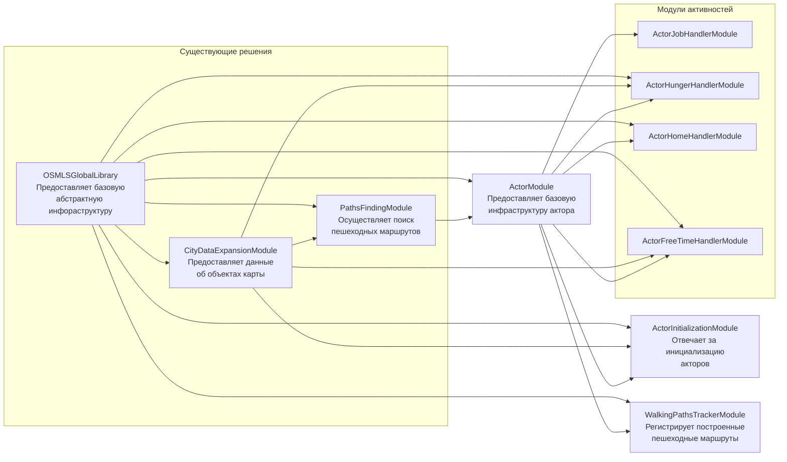

```mermaid
graph LR
    subgraph Существующие решения
    OSMLSGlobalLibrary[OSMLSGlobalLibrary<br/>Предоставляет базовую<br/>абстрактную инфораструктуру];

    CityDataExpansionModule[CityDataExpansionModule<br/>Предоставляет данные<br/>об объектах карты];
    PathsFindingModule[PathsFindingModule<br/>Осуществляет поиск<br/>пешеходных маршрутов];
    end

    ActorModule[ActorModule<br/> Предоставляет базовую<br/>инфраструктуру актора];
    ActorInitializationModule[ActorInitializationModule<br/>Отвечает за инициализацию<br/>акторов];

    subgraph Модули активностей
    ActorJobHandlerModule[ActorJobHandlerModule];
    ActorHungerHandlerModule[ActorHungerHandlerModule];
    ActorHomeHandlerModule[ActorHomeHandlerModule];
    ActorFreeTimeHandlerModule[ActorFreeTimeHandlerModule];
    end

    WalkingPathsTrackerModule[WalkingPathsTrackerModule<br/>Регистрирует построенные<br/>пешеходные маршруты];

    OSMLSGlobalLibrary-->CityDataExpansionModule;
    OSMLSGlobalLibrary-->PathsFindingModule;
    OSMLSGlobalLibrary-->ActorModule;
    OSMLSGlobalLibrary-->ActorInitializationModule;
    OSMLSGlobalLibrary-->ActorHungerHandlerModule;
    OSMLSGlobalLibrary-->ActorHomeHandlerModule;
    OSMLSGlobalLibrary-->ActorFreeTimeHandlerModule;
    OSMLSGlobalLibrary-->WalkingPathsTrackerModule;

    CityDataExpansionModule-->PathsFindingModule;
    CityDataExpansionModule-->ActorInitializationModule;
    CityDataExpansionModule-->ActorHungerHandlerModule;
    CityDataExpansionModule-->ActorFreeTimeHandlerModule;

    PathsFindingModule-->ActorModule;

    ActorModule-->ActorInitializationModule;
    ActorModule-->ActorJobHandlerModule;
    ActorModule-->ActorHungerHandlerModule;
    ActorModule-->ActorHomeHandlerModule;
    ActorModule-->ActorFreeTimeHandlerModule;
    ActorModule-->WalkingPathsTrackerModule;
```
